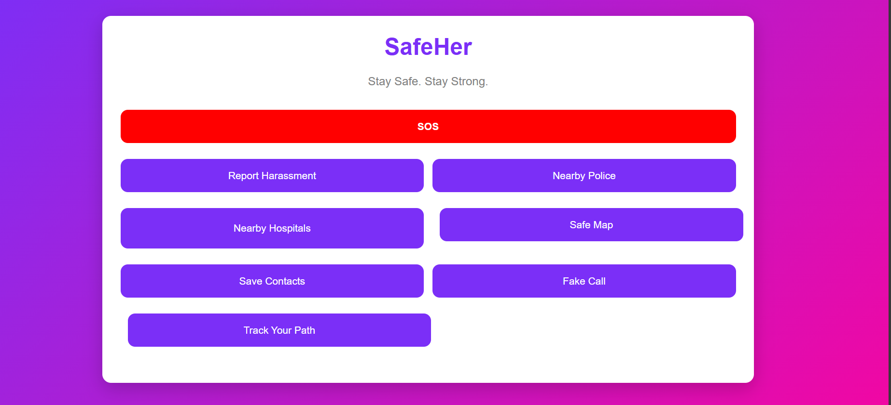
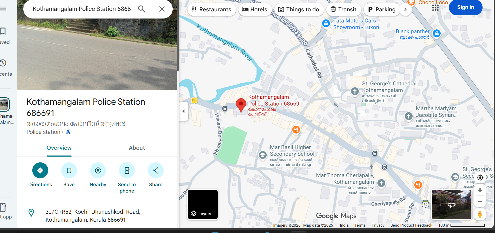
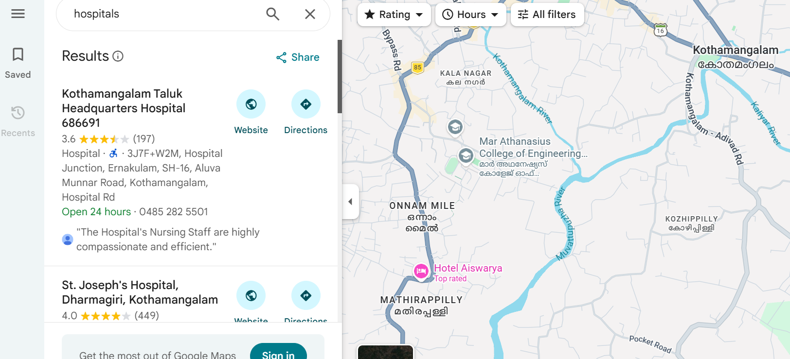
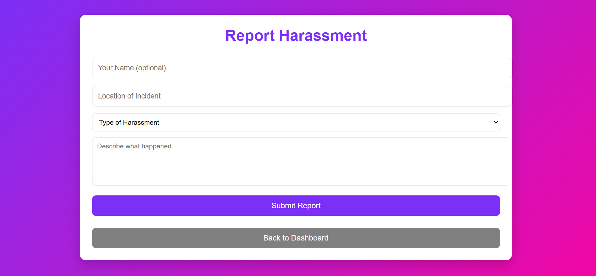
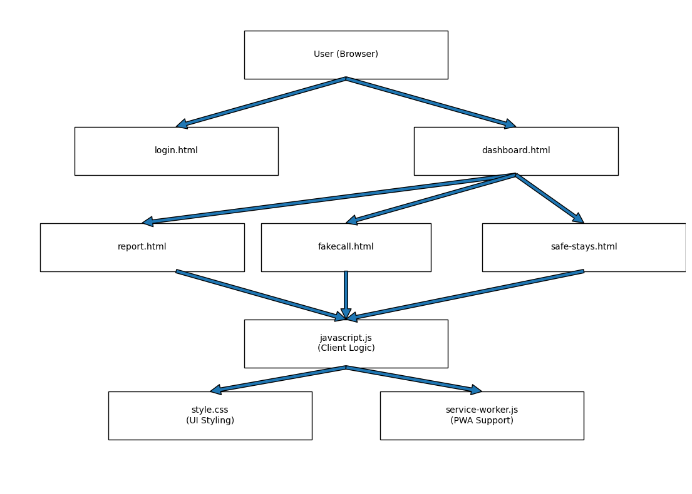

<p align="center">
  
</p>

#  SafeHer

## Basic Details

### Team Name: Compiler

### Team Members
- Member 1: Liba M - Mar Athanasius College Of Engineering
- Member 2: Neha Maria Pullatt - Mar Athanasius College Of Engineering

### Hosted Project Link
[https://github.com/libamanningal2006-glitch/SafeHer.git]

### Project Description
it is a women safety app which makes travel easier for women to provide so many safety measures which ensure women safety

### The Problem statement
we are solving daily problems suffered by women who travel alone and cant find a safe place to stay

### The Solution
we are providing safer alternatives for  women and also help them during emergencies

---

## Technical Details

### Technologies/Components Used

**For Software:**
- frontend: [e.g., JavaScript,HTML,CSS,leaflet]
- Tools used: [e.g., VS Code, Git]


---

## Features

List the key features of your project:
- Feature 1: Instant SOS Alerts: Users can trigger immediate alerts in dangerous situations to notify trusted contacts and community responders
- Feature 2: Live Location Sharing: Sends real‑time GPS coordinates to trusted contacts or nearby helpers so they know exactly where the user is
- Feature 3: Real‑Time Map & Safe Paths: Interactive maps show the user’s current location and recommended safe routes. Some versions include safe route planners based on community data
- Feature 4: fake call option
- Feature 5: easy access to nearby hospitals and police station
- Feature 6:safe stay:shows safe stay options for  women

---

## Implementation

### For Software:

#### Installation
```bash
[Installation commands - winget install --id Microsoft.VisualStudioCode -e]
```

#### Run
```bash
[Run commands - javascript.js]
```

---

## Project Documentation

### For Software:

#### Screenshots

login page:
*this is our login page where we enter our email id and password*

 dashboard:
*this is our dashboard which shows all the features*

 nearby police station:
*shows police station nearby*
 nearby hospital:
*shows hospitals nearby*
 harassment reporting:
*we can report abuse here*


#### Diagrams

**System Architecture:**




---


## Additional Documentation


**Human Contributions:**
- Architecture design and planning
- Custom business logic implementation
- Integration and testing


---

## Team Contributions

- Liba M: [Specific contributions - e.g., Frontend development, API integration.]
- Neha Maria Pullatt: [Specific contributions - e.g., Frontend development, Design,testing etc.]


---

