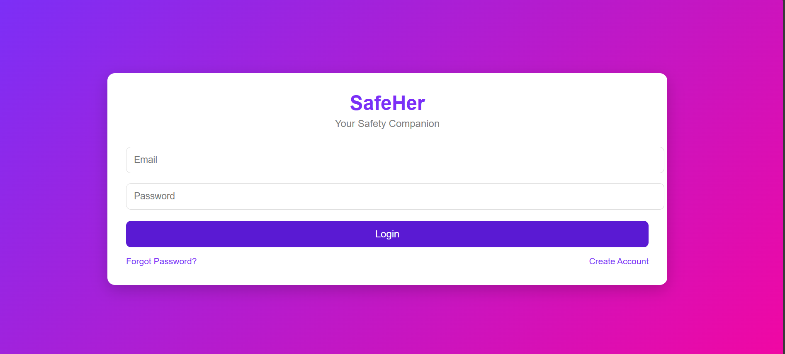

<p align="center">
  
</p>

#  SafeHer

## Basic Details

### Team Name: Compiler

### Team Members
- Member 1: Liba M - Mar Athanasius College Of Engineering
- Member 2: Neha Maria Pullatt - Mar Athanasius College Of Engineering

### Hosted Project Link
[mention your project hosted link here]

### Project Description
it is a women safety app which makes travel easier for women to provide so many safety measures which ensure women safety

### The Problem statement
we are solving daily problems suffered by women who travel alone and cant find a safe place to stay

### The Solution
we are providing safer alternatives for  women and also help them during emergencies

---

## Technical Details

### Technologies/Components Used

**For Software:**
- frontend: [e.g., JavaScript,HTML,CSS,leaflet]
- Tools used: [e.g., VS Code, Git]


---

## Features

List the key features of your project:
- Feature 1: Instant SOS Alerts: Users can trigger immediate alerts in dangerous situations to notify trusted contacts and community responders
- Feature 2: Live Location Sharing: Sends real‑time GPS coordinates to trusted contacts or nearby helpers so they know exactly where the user is
- Feature 3: Real‑Time Map & Safe Paths: Interactive maps show the user’s current location and recommended safe routes. Some versions include safe route planners based on community data
- Feature 4: fake call option
- Feature 5: easy access to nearby hospitals and police station
- Feature 6:safe stay:shows safe stay options for  women

---

## Implementation

### For Software:

#### Installation
```bash
[Installation commands - winget install --id Microsoft.VisualStudioCode -e]
```

#### Run
```bash
[Run commands - javascript.js]
```

---

## Project Documentation

### For Software:

#### Screenshots

login page
*this is our login page where we enter our email id and password*


*Add caption explaining what this shows*


*Add caption explaining what this shows*

#### Diagrams

**System Architecture:**


*Explain your system architecture - components, data flow, tech stack interaction*

**Application Workflow:**


*Add caption explaining your workflow*

---

### For Hardware:

#### Schematic & Circuit


*Add caption explaining connections*


*Add caption explaining the schematic*

#### Build Photos


*List out all components shown*


*Explain the build steps*


*Explain the final build*

---

## Additional Documentation


## AI Tools Used (Optional - For Transparency Bonus)

If you used AI tools during development, document them here for transparency:

**Tool Used:** [e.g., GitHub Copilot,ChatGPT,]

**Purpose:** for coding and debugging
functions"
- Example: Code review and optimization suggestions


**Percentage of AI-generated code:** [Approximately X%]

**Human Contributions:**
- Architecture design and planning
- Custom business logic implementation
- Integration and testing
- UI/UX design decisions

*Note: Proper documentation of AI usage demonstrates transparency and earns bonus points in evaluation!*

---

## Team Contributions

- [Name 1]: [Specific contributions - e.g., Frontend development, API integration, etc.]
- [Name 2]: [Specific contributions - e.g., Backend development, Database design, etc.]
- [Name 3]: [Specific contributions - e.g., UI/UX design, Testing, Documentation, etc.]

---

## License

This project is licensed under the [LICENSE_NAME] License - see the [LICENSE](LICENSE) file for details.

**Common License Options:**
- MIT License (Permissive, widely used)
- Apache 2.0 (Permissive with patent grant)
- GPL v3 (Copyleft, requires derivative works to be open source)

---

Made with ❤️ at TinkerHub